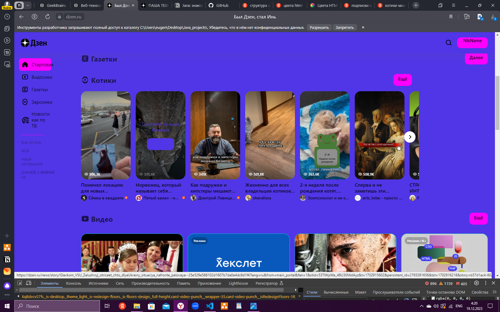

Задача: на основе сайта yandex.ru:
- Определите, на каком протоколе работает сайт.
- Проанализируйте структуру страницы сайта.
- Внесите не менее 10 изменений на страницу с помощью инструмента разработчика и представьте скриншоты было/стало.
- Создайте прототип низкой детализации (дополнительное задание, если на семинаре дошли до задания №8).

- Протокол https://
- Главная страница-строка поиска/погода/город/курс - навигационная панель поиска-кнопка перхода на сайт Дзен-контент новостной с навигацией и доп.клавишами переходами - под панелью все о сайте, чуть ниже новостей, расположен разныq видеоконтент

Определите, на каком протоколе работает сайт youtube.com.
Сделайте скриншот с названием 1_protocol.jpg, по которому станет понятно, как вы определили протокол сайта.

проанализируйте структуру страницы сайта <https://dzen.ru/?yredirect=true>, а именно нужно описать (коротко, своими словами), какие блоки есть на сайте, что в этих блоках находится. Есть ли на сайте шапка, подвал, что в них содержится? Как и где расположен контент? Есть ли дополнительные элементы на странице?

Внесите не менее 10 изменений на страницу любой статьи сайта <https://dzen.ru/?yredirect=true>, с помощью инструмента разработчика и представьте два скриншота было/стало (скриншоты должны иметь названия 3_before.jpg, 3_after.jpg соответственно). Желательно поработать с изменением текста на странице, заменой картинки, изменением стилей.

Создайте прототип низкой детализации сайта <https://dzen.ru/> с помощью сайта <https://wireframe.cc/>.

 Примечание к работе:
Расширение картинки не обязательно должно быть .jpg, подойдет любое из популярных расширений для картинок.
Обычные текстовые файлы необходимо создать с кодировкой UTF-8, это стандартная кодировка, с которой создаются файлы в vscode.
В html можно символы вставлять в виде кода, таблица символов unicode:
<https://unicode-table.com/ru/>
<http://foxtools.ru/Unicode>
Как работает шифрование (и ssl в частности):
<https://youtu.be/YtFM-smD9fQ>
Сайт, где можно сделать прототип низкой детализации:
<https://wireframe.cc/>